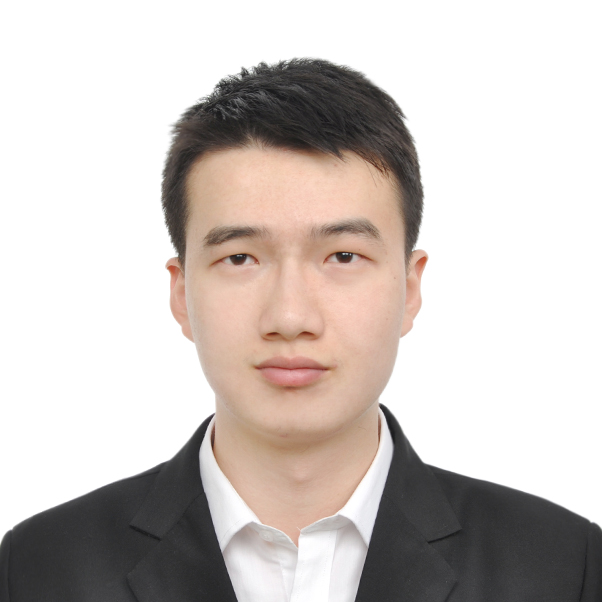
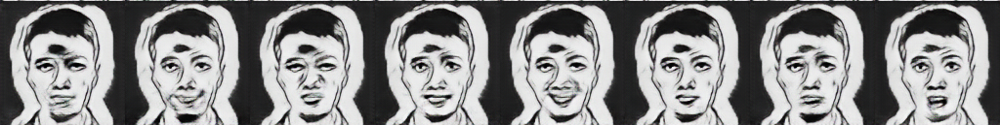

# Meme_Generation
Use GAN to generate Memes
<p align="center"></p>
<p align="center"></p>
1. Train the network for Fast Neural Style Transfer 
```bash
$ cd Fast_Style_Transfer
$ python train.py -c conf/nahan.yml
```
(you can change the yml file as you like, such as the model file path and the style image path)

2. Transfer the style of training images and test images
```bash
$ python inference.py --model_file <model_file> --image_file <foldername>
```

3. Train the Generator
```bash
$ cd ..
$ cd GAN
$ python main.py --mode='train' --c_dim=8 --image_size=128 --num_epochs=200 --num_epochs_decay=100 --sample_step=25 --model_save_step=60 --sample_path='stargan_rafd/samples' --log_path='stargan_rafd/logs' --model_save_path='stargan_rafd/models' --result_path='stargan_rafd/results'
```
4. Generate the Meme
```bash
python main.py --mode='test' --c_dim=8 --image_size=128 --test_model='200_60' --rafd_image_path='data/RaFD/test' --sample_path='stargan_rafd/samples' --log_path='stargan_rafd/logs' --model_save_path='stargan_rafd/models' --result_path='stargan_rafd/results'
```

Acknowledgement

Thanks the authors of StarGAN and Fast_Neural_Style_Transfer !

@article{choi2017stargan,
 title = {StarGAN: Unified Generative Adversarial Networks for Multi-Domain Image-to-Image Translation},    
 author = {Choi, Yunjey and Choi, Minje and Kim, Munyoung and Ha, Jung-Woo and Kim, Sunghun and Choo, Jaegul},
 journal= {arXiv preprint arXiv:1711.09020},
 Year = {2017}
}

https://github.com/yunjey/StarGAN

https://github.com/OlavHN/fast-neural-style

